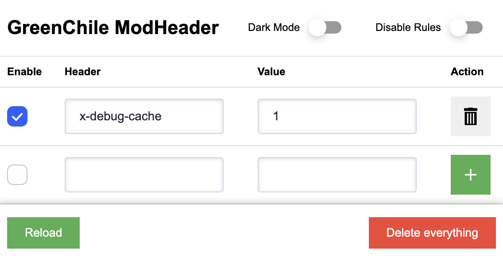

# a8c ModHeader Extension for Chrome

This is a Chrome extension that allows you to modify request headers for all requests in a page. It can be useful for development, debugging and security testing.

## Features

- Add, modify or remove request headers.

## Installation

1. Clone this repository or download the ZIP file.
2. Open Chrome and go to `chrome://extensions/`.
3. Enable "Developer mode" in the top right corner.
4. Click on "Load unpacked" and select the folder where you cloned or extracted the ZIP file.

## Usage

1. Click on the extension icon in the toolbar.
2. Fill in the header name and value.
3. Click on the "Add" button to add a new header.
4. Click on the "Reload" button to reload the page with the new headers.

screenshot:
